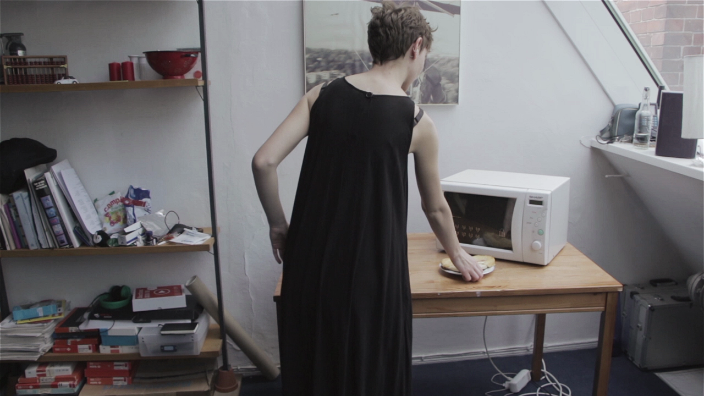
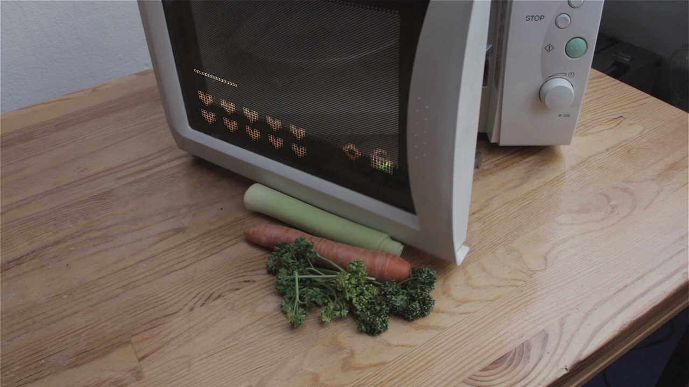
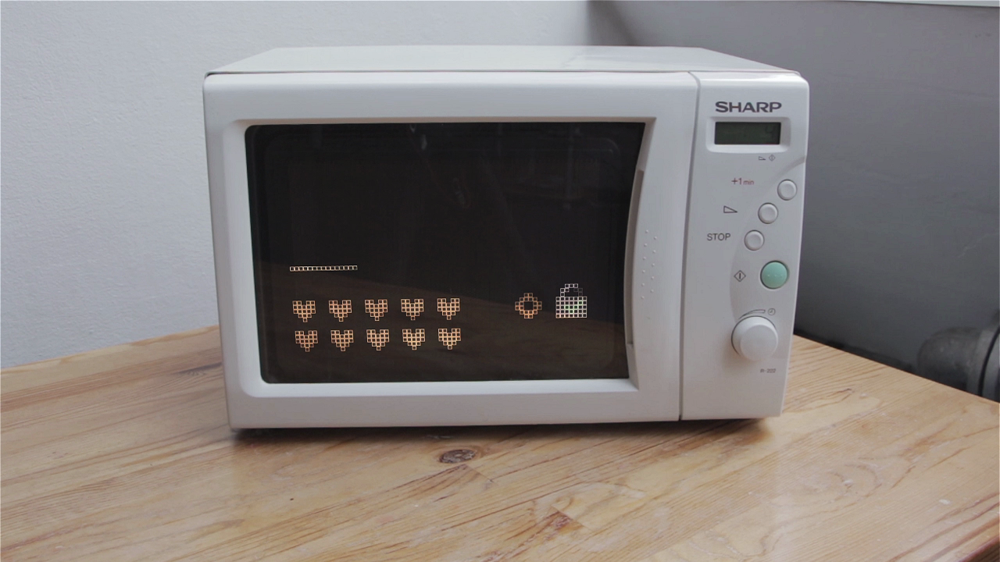

## Assignment

The task of this assignment was to make a video prototype to illustrate a device with a certain characteristic. In this case the task was to create an annoying microwave. To enhance the possibilities in the live-action footage the use of computer graphics was allowed.

## Idea

One major challenge was to assign the characteristic *annoying* to a microwave. First there had to be defined how a microwave could act annoyingly. These five approaches have been considered:

1. Sound
   An annoying sound design can easily disturb people. Especially when it is very loud and shrilly.
2. Need of Maintenance
   Devices that need maintenance frequently are perceived annoying as well. Particularly when it takes a lot of time or can only be done by professionals.
3. not functioning properly
   When something works from the technical point of view, but does not satisfy the user’s intentions. e. g. the microwave reheats but always burns the food.
4. Complexity
   When a device has bad usability.
5. Patronising
   When the device has the power to decide or command the user, e. g. the apple watch that tells the user when to stand up and move.

Eventually the patronising microwave has been chosen, because it best fits a futuristic setting. Also, the microwave should not be malfunctioning in the first place: it should be perceived annoying because it works as promised.  
Patronising devices are most oftenly used in the context of health and fitness. Therefore a microwave that examines the nutritiousness of the food was contrived. It scans the food and displays the nutritional factor on the glass front. Whenever the food is not healthy enough it refuses to open the door. This way the user should be forced to a healthy diet.

## Story

A young woman is hungry and wants to prepare some food with the microwave. She places a cheese straw in front of the microwave to scan it. The microwave displays a bad nutritional factor and denies to reheat it. The woman is disappointed and tries to warm up some other food, this time it is a doughnut. The microwave denies permission once again and the woman is outraged. She gets herself some vegetables and slams them onto the desk in front of the microwave. The microwave scans the food; this time it classifies it as nourishing and grants permission: the door opens. The woman has an idea: she tricks the microwave by placing the unhealthy cheese straw inside the opened microwave and starts the program. The microwave proceeds to warm up the food.

## Realisation

The interface of the microwave was made in Illustrator and mapped onto the surface with After Effects. The scenes where the actress covers parts of the UI with her body were particularly challenging. For those cases masks have been made to avoid the interface appearing on the actresse’s skin.

The style of the interface had to match the microwave therefore a retro style has been chosen. The top bar shows the scanning process; the heart icons symbolise the nutrients—the more hearts light up, the healthier the food. On the left side of the screen there is a lock symbol: when it displays a red cross, permission is denied; when it displays a green check mark, permission is granted.

Additionally, a special sound design has been added. It rounds out the user experience and gives a realistic impression.